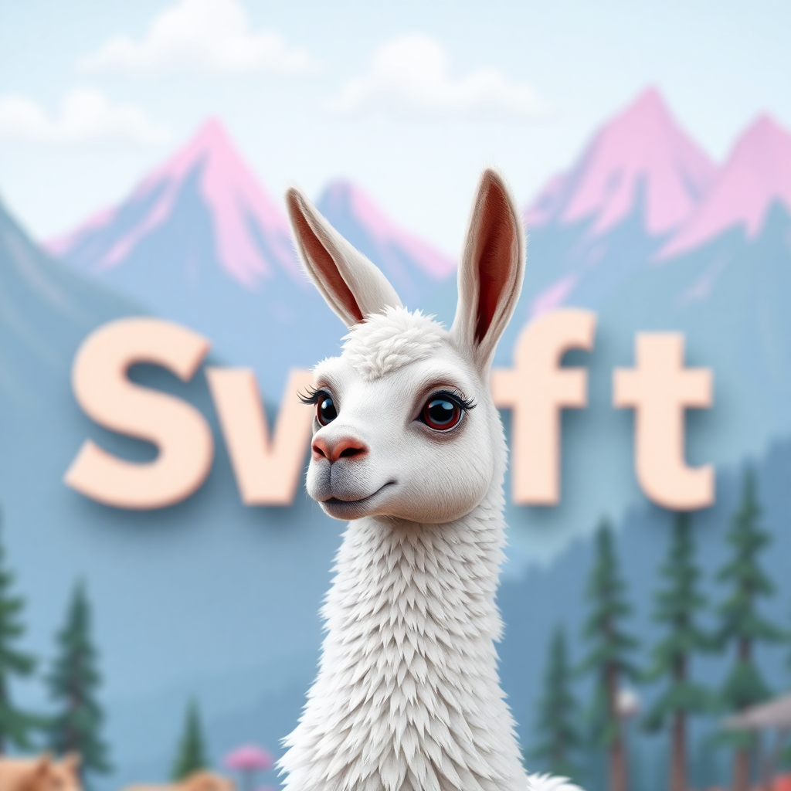

# Llama2.swift



**A Swift implementation of Llama2 text generation, designed for Swift developers without data science or Python background.**

This project is part of a series of blog posts: **"Demystifying LLMs for Swift Developers"** - making large language models accessible to the Swift community.

## What is this?

This is a Swift port of the [llama2.c](https://github.com/karpathy/llama2.c) project, implementing the Llama2 language model in pure Swift. The goal is to provide Swift developers with a clear, educational implementation that demonstrates how large language models work under the hood, without requiring Python or deep learning expertise.

## Features

- **Pure Swift implementation** - No external dependencies beyond Foundation and ArgumentParser
- **Educational focus** - Clean, readable code with detailed comments
- **CLI interface** - Easy-to-use command-line tool for text generation and chat
- **Tokenizer conversion** - Tool to convert HuggingFace tokenizers to Swift format
- **Memory efficient** - Automatic memory management with Swift's ARC
- **Cross-platform** - Works on macOS, Linux, and other Swift-supported platforms

## Quick Start

### Prerequisites

- Swift 6.1 or later
- A Llama2 model checkpoint file (`.bin` format)

### Installation

```bash
# Clone the repository
git clone https://github.com/yourusername/llama2.swift.git
cd llama2.swift

# Build the project
swift build -c release

# Run with the included sample model
swift run Llama2 -n 256 -i "Once upon a time"
```

### Basic Usage

```bash
# Generate text with a custom prompt
swift run Llama2 model.bin -n 256 -i "The future of AI is"

# Chat mode with system prompt
swift run Llama2 model.bin -m chat -i "Hello!" -y "You are a helpful assistant."

# Adjust generation parameters
swift run Llama2 model.bin -t 0.8 -p 0.9 -n 512 -i "Write a short story"
```

## CLI Options

The Llama2.swift CLI provides comprehensive control over text generation:

### Required Arguments

- `checkpointPath`: Path to the model checkpoint file (e.g., `out/model.bin`)

### Generation Options

- `-t, --temperature <value>`: Temperature for sampling (0.0 = deterministic, 1.0 = creative, default: 1.0)
- `-p, --top-p <value>`: Top-p (nucleus) sampling parameter (0.0-1.0, default: 0.9)
- `-s, --seed <value>`: Random seed for reproducible results (default: current timestamp)
- `-n, --steps <value>`: Number of tokens to generate (0 = max sequence length, default: 256)

### Input Options

- `-i, --prompt <text>`: Input prompt for generation
- `-m, --mode <mode>`: Generation mode (`generate` or `chat`, default: `generate`)
- `-y, --system-prompt <text>`: System prompt for chat mode

### Model Options

- `-z, --tokenizer-path <path>`: Path to custom tokenizer file (default: bundled tokenizer)

### Examples

```bash
# Generate a creative story
swift run Llama2 model.bin -t 1.2 -n 500 -i "In a world where magic exists..."

# Deterministic generation with fixed seed
swift run Llama2 model.bin -t 0.0 -s 42 -n 100 -i "The answer is"

# Interactive chat session
swift run Llama2 model.bin -m chat -y "You are a coding assistant."

# Use custom tokenizer
swift run Llama2 model.bin -z custom_tokenizer.json -i "Hello world"
```

## TokenizerConversion Tool

The `TokenizerConverter` tool helps convert HuggingFace tokenizers to the format used by Llama2.swift.

### Purpose

Many Llama2 models come with HuggingFace tokenizers that need to be converted to work with this Swift implementation. The conversion tool:

- Extracts vocabulary and merge rules from HuggingFace tokenizer files
- Converts them to a JSON format compatible with the Swift tokenizer
- Handles special tokens and byte-level encoding

### Usage

```bash
# Convert a HuggingFace tokenizer
swift run TokenizerConverter tokenizer.json output_tokenizer.json

# Convert with custom vocabulary size
swift run TokenizerConverter tokenizer.json output_tokenizer.json --vocab-size 32000
```

### Options

- `inputPath`: Path to the HuggingFace tokenizer file
- `outputPath`: Path for the converted Swift tokenizer
- `--vocab-size <size>`: Override vocabulary size (optional)

## Project Structure

```
Llama2/
├── Sources/
│   ├── Llama2/                 # Main Llama2 implementation
│   │   ├── Llama2.swift        # CLI interface and main logic
│   │   ├── Transformer.swift   # Neural network implementation
│   │   ├── Tokenizer.swift     # Text tokenization
│   │   ├── Sampler.swift       # Token sampling strategies
│   │   ├── Math.swift          # Mathematical operations
│   │   └── Llama2Error.swift   # Error handling
│   └── TokenizerConverter/     # Tokenizer conversion tool
├── Resources/                  # Model files and tokenizers
└── Docs/                       # Documentation
```

## How It Works

### 1. Tokenization
Text is converted into tokens using the tokenizer, which breaks down words and subwords into integer representations.

### 2. Transformer Processing
The transformer processes tokens through multiple layers of attention and feed-forward networks, generating logits (probability scores) for the next token.

### 3. Sampling
The sampler selects the next token based on the logits, using techniques like temperature scaling and top-p sampling to control randomness.

### 4. Generation Loop
The process repeats, generating one token at a time until the desired length or stopping condition is reached.

## Educational Value

This implementation is designed to be educational for Swift developers:

- **No black boxes**: Every component is implemented from scratch
- **Clear architecture**: MVVM-style separation of concerns
- **Swift idioms**: Uses modern Swift features like value types, optionals, and error handling
- **Memory safety**: Leverages Swift's automatic memory management
- **Performance**: Optimized for Swift's performance characteristics

## Performance

The Swift implementation provides good performance while maintaining readability:

- **Memory efficient**: Automatic memory management with ARC
- **Fast execution**: Optimized for Swift's performance characteristics
- **Cross-platform**: Works on macOS, Linux, and other Swift-supported platforms

## Contributing

Contributions are welcome! This project aims to be educational, so:

- Keep code readable and well-commented
- Add tests for new features
- Follow Swift style guidelines
- Document any complex algorithms or decisions

## License

This project is licensed under the MIT License - see the LICENSE file for details.

## Acknowledgments

- Based on the excellent [llama2.c](https://github.com/karpathy/llama2.c) by Andrej Karpathy
- Inspired by the need to make LLMs accessible to Swift developers
- Built with the goal of education and understanding

## Blog Series

This project is part of the **"Demystifying LLMs for Swift Developers"** series, which includes:

1. **Introduction to Large Language Models** - Understanding the basics
2. **Tokenization Deep Dive** - How text becomes numbers
3. **Transformer Architecture** - The neural network that powers modern LLMs
4. **Sampling Strategies** - How models choose the next word
5. **Building Your Own LLM** - This implementation

Each post builds on the previous ones, taking Swift developers from zero knowledge to a working understanding of how LLMs function.

---

**Happy coding! 🦙✨** 